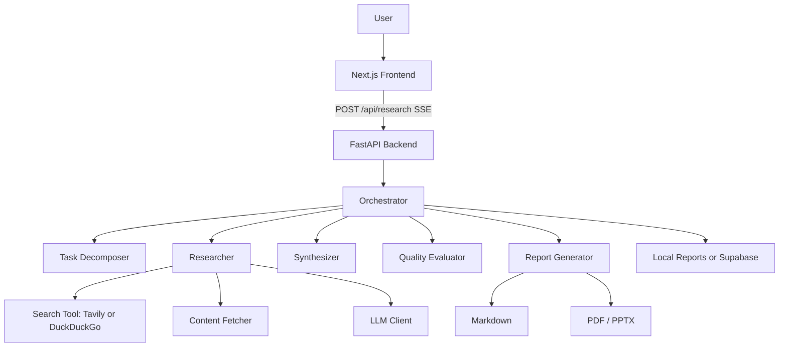

# AI Research Agent

[](https://github.com/Fhonglei/ai-research-agent/actions/workflows/ci.yml)

AI Research Agent is a full-stack research automation app. Users enter a topic, choose a research depth, and receive a sourced markdown report with PDF and PowerPoint export options.

This project is designed as a portfolio-ready AI engineering project: it shows frontend product work, FastAPI backend design, LLM orchestration, web search integration, streaming progress, report generation, quality evaluation, testing, and deployment readiness.

## Demo

- Frontend: https://ai-research-agent-frontend.vercel.app
- Backend health check: https://ai-research-agent-api-production.up.railway.app/api/health
- Demo script: `docs/DEMO_SCRIPT.md`
- Production checklist: `docs/PRODUCTION_CHECKLIST.md`
- Local frontend: `http://localhost:3000`
- Local backend docs: `http://localhost:8000/docs`

The deployed backend will report `degraded` until `DEEPSEEK_API_KEY` is configured. Add `TAVILY_API_KEY` for better source quality.

## What It Does

1. Decomposes a broad topic into focused research tracks.
2. Searches the web with Tavily, with DuckDuckGo fallback.
3. Fetches and extracts readable source content.
4. Summarizes each research track with citations.
5. Synthesizes a final markdown report.
6. Generates PDF and PowerPoint exports.
7. Stores report history locally or in Supabase.
8. Scores report quality with source, citation, domain, and task-success metrics.

## Key Features

- Multi-step agent pipeline: decomposition, research, synthesis, export.
- SSE streaming: the frontend shows live progress while research is running.
- Configurable search depth and concurrency controls.
- Source extraction safety checks for local/private URLs.
- Quality metrics: confidence score, citation coverage, unique source domains, warnings.
- Report history with local filesystem fallback and optional Supabase persistence.
- Docker Compose local startup.
- Vercel frontend and Railway/Render backend deployment support.
- Backend tests for parsing, search mocking, report generation, and quality evaluation.

## Architecture



## Tech Stack

| Layer | Technology |
| --- | --- |
| Frontend | Next.js 15, React, TypeScript, Tailwind CSS, shadcn-style UI |
| Backend | FastAPI, Pydantic, SSE |
| AI | DeepSeek by default, Anthropic optional |
| Search | Tavily API, DuckDuckGo fallback |
| Extraction | httpx, BeautifulSoup, lxml |
| Export | Markdown, WeasyPrint PDF, python-pptx |
| Storage | Local filesystem, optional Supabase |
| DevOps | Docker Compose, Render Blueprint, Railway config |
| Tests | pytest, mocked search, quality scoring tests |

## Quick Start

### 1. Clone and configure

```bash
git clone https://github.com/Fhonglei/ai-research-agent.git
cd ai-research-agent
cp .env.example .env
```

Edit `.env` and set at least one LLM key:

```env
LLM_PROVIDER=deepseek
DEEPSEEK_API_KEY=sk-your-key
TAVILY_API_KEY=tvly-your-key
CORS_ORIGINS=http://localhost:3000
```

Tavily is optional. Without it, the backend falls back to DuckDuckGo.

### 2. Run with Docker Compose

```bash
docker compose up --build
```

Open:

- Frontend: `http://localhost:3000`
- Backend: `http://localhost:8000`
- API docs: `http://localhost:8000/docs`

### 3. Run manually

Backend:

```bash
cd backend
python -m venv .venv
.venv\Scripts\activate
pip install -r requirements.txt
uvicorn main:app --reload --port 8000
```

Frontend:

```bash
cd frontend
npm install
npm run dev
```

## Environment Variables

| Variable | Required | Description |
| --- | --- | --- |
| `LLM_PROVIDER` | No | `deepseek` or `anthropic` |
| `DEEPSEEK_API_KEY` | Yes for DeepSeek | LLM API key |
| `ANTHROPIC_API_KEY` | Yes for Anthropic | Anthropic API key |
| `TAVILY_API_KEY` | No | Better live search quality |
| `SUPABASE_URL` | No | Optional report persistence |
| `SUPABASE_ANON_KEY` | No | Optional report persistence |
| `CORS_ORIGINS` | Yes in production | Comma-separated frontend URLs |
| `MAX_PARALLEL_RESEARCH_TASKS` | No | Controls cost and concurrency |
| `SEARCH_MAX_RESULTS` | No | Search results per subtopic |
| `FETCH_TOP_N` | No | Full pages fetched per subtopic |
| `REQUIRE_LLM_FOR_RESEARCH` | No | Fail early if no LLM key |
| `NEXT_PUBLIC_API_URL` | Yes for frontend | Public backend API URL |

## API

| Method | Endpoint | Description |
| --- | --- | --- |
| `GET` | `/api/health` | Health, model, provider, config status |
| `POST` | `/api/research` | Start research and stream progress with SSE |
| `GET` | `/api/history` | List generated reports |
| `GET` | `/api/report/{id}` | Fetch one report |
| `GET` | `/api/report/{id}/quality` | Fetch report quality metrics |
| `GET` | `/api/report/{id}/markdown` | Fetch raw markdown |
| `GET` | `/api/report/{id}/download?format=pdf` | Download PDF |
| `GET` | `/api/report/{id}/download?format=pptx` | Download PowerPoint |

## Quality Evaluation

Each report includes lightweight quality signals:

- `source_count`: unique source URLs collected.
- `unique_domain_count`: source diversity.
- `citation_count`: inline citation markers such as `[1]`.
- `citation_coverage`: percentage of completed tracks with citations.
- `success_rate`: percentage of tracks completed successfully.
- `confidence_score`: 0-100 heuristic score.
- `warnings`: actionable issues, such as thin source coverage.

This makes the project stronger for interviews because it shows that the system evaluates AI output quality instead of only calling an LLM.

## Testing

Backend:

```bash
cd backend
pytest
```

Frontend:

```bash
cd frontend
npm install
npm run lint
npm run typecheck
npm run build
```

## Deployment

Recommended portfolio deployment:

- Frontend: Vercel
- Backend: Railway or Render
- Optional database: Supabase

### Backend on Railway

Use `backend/railway.toml`. Set these variables:

```env
DEEPSEEK_API_KEY=...
TAVILY_API_KEY=...
CORS_ORIGINS=https://your-frontend.vercel.app
REQUIRE_LLM_FOR_RESEARCH=true
```

### Backend on Render

Use `render.yaml`. After creating the service, set the same secret variables in the Render dashboard.

### Frontend on Vercel

Set:

```env
NEXT_PUBLIC_API_URL=https://your-backend-domain
```

Then redeploy the frontend.

## Why This Helps Internship Applications

This project is useful for AI/full-stack internships because it demonstrates:

- Product thinking: a complete user workflow from prompt to exportable report.
- Backend engineering: API design, validation, streaming, error handling, configuration.
- AI engineering: prompt design, agent orchestration, search grounding, quality evaluation.
- Frontend engineering: responsive UI, progress states, report rendering, downloads.
- DevOps basics: Docker Compose, cloud deployment config, environment isolation.
- Testing mindset: deterministic tests with mocked network dependencies.

## Resume Bullets

- Built a full-stack AI research agent using Next.js and FastAPI that decomposes topics, searches web sources, synthesizes findings, and exports reports to Markdown, PDF, and PowerPoint.
- Implemented an SSE-based progress pipeline for real-time research status across decomposition, search, summarization, synthesis, and export stages.
- Added report quality evaluation with source coverage, citation coverage, unique-domain diversity, task success rate, and confidence scoring.
- Hardened the backend with request validation, configurable CORS, SSRF-aware content fetching, concurrency limits, and deterministic pytest coverage.

## Roadmap

- User accounts and per-user report isolation.
- Scheduled recurring research jobs.
- Academic sources such as arXiv and Semantic Scholar.
- Better citation verification and source deduplication.
- Queue-based background jobs for long-running deep research.
- Persistent object storage for generated PDF/PPTX files.
